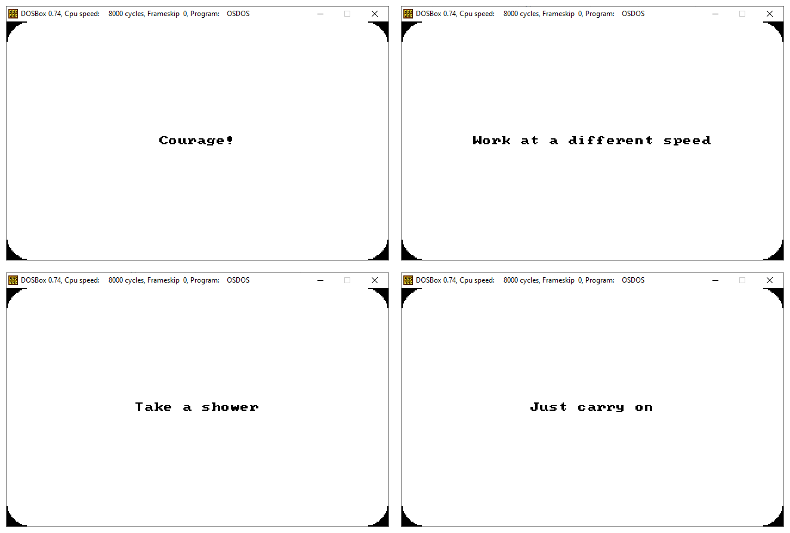

# Oblique Strategies for MS-DOS

This project is a port of Brian Eno's Oblique Strategies to MS-DOS, implemented in FreeBASIC. Oblique Strategies is a set of cards created by Brian Eno and Peter Schmidt, intended to help artists and musicians break creative blocks by providing random directives.

You can try it @ https://vcotta.itch.io/oblique-strategies-ms-dos



## Features

- Randomly displays one of the Oblique Strategies cards.
- Simple and intuitive command-line interface.
- Lightweight and runs on MS-DOS, as well on FreeDOS.

## Requirements

- MS-DOS or a compatible environment (e.g., DOSBox).
- FreeBASIC compiler (for building from source).

## Installation

1. Clone the repository:
   ```bash
   git clone https://github.com/vc0tta/oblique-strategies-ms-dos.git
   cd oblique-strategies-msdos
   ```

2. Compile the source code using FreeBASIC:
   ```bash
	@echo off
	fbc.exe -x osdos0.exe osdos.bas
	exe2coff osdos0.exe
	copy /b cwsdstub.exe+osdos0 osdos.exe
	del osdos0.exe
   ```
   [CWSDPMI](https://sandmann.dotster.com/cwsdpmi/) must be unpacked into fbc.exe directory (see references).

3. Run the executable:
   ```bash
   osdos.exe
   ```

## Usage

Upon running the program, a random Oblique Strategy will be displayed. You can press any key to generate a new strategy, and ESCAPE to get back to the CLI.

## Parameters

- **osdos /?**: Displays help at the command prompt. 
- **osdos /T**: Displays a random card in text mode. 

## License

This project is licensed under the GNU General Public License v3.0. See the [LICENSE](LICENSE) file for more details.

## Acknowledgments

- Brian Eno and Peter Schmidt for the original Oblique Strategies.
- The FreeBASIC community for their support and resources.

## References

Oblique Strategies. In Wikipedia, The Free Encyclopedia. https://en.wikipedia.org/wiki/Oblique_Strategies

DOS related FAQ - FreeBASIC Wiki Manual | FBWiki. (2019). Freebasic.net. https://www.freebasic.net/wiki/FaqDOS#item4

DRAW STRING - FreeBASIC Wiki Manual | FBWiki. (2019). Freebasic.net. https://www.freebasic.net/wiki/KeyPgDrawstring

‌CWSDPMI - Free DPMI provider for DOS. (2025). Dotster.com. https://sandmann.dotster.com/cwsdpmi/

‌DJGPP Utilities Reference. (2016). Delorie.com. https://www.delorie.com/djgpp/doc/utils/utils_16.html

Page Index - FreeBASIC Wiki Manual | FBWiki. (2025). Freebasic.net. https://www.freebasic.net/wiki/PageIndex

‌sansumbrella/Processing-ObliqueStrategies: Processing tool for generating useful dilemmas. (2025). GitHub. https://github.com/sansumbrella/Processing-ObliqueStrategies/tree/master